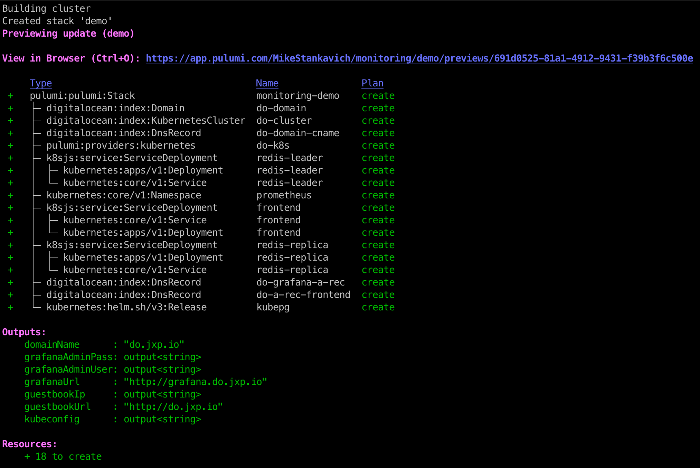
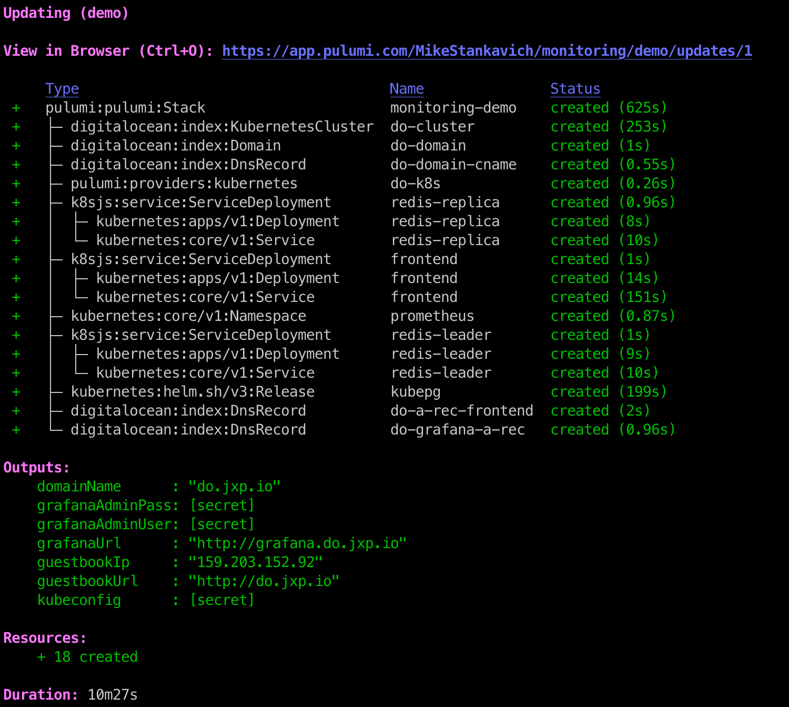
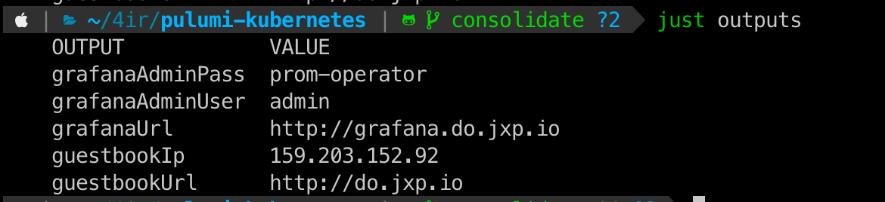
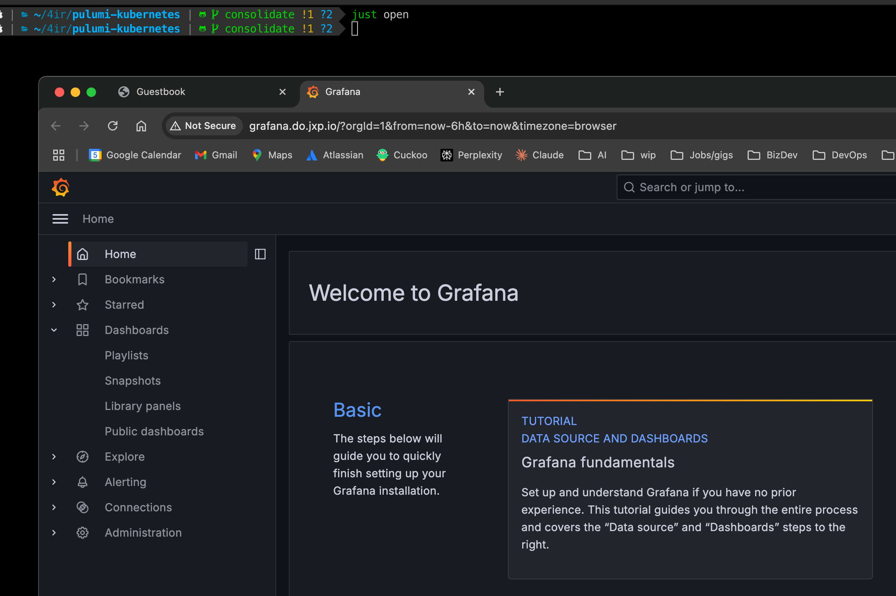
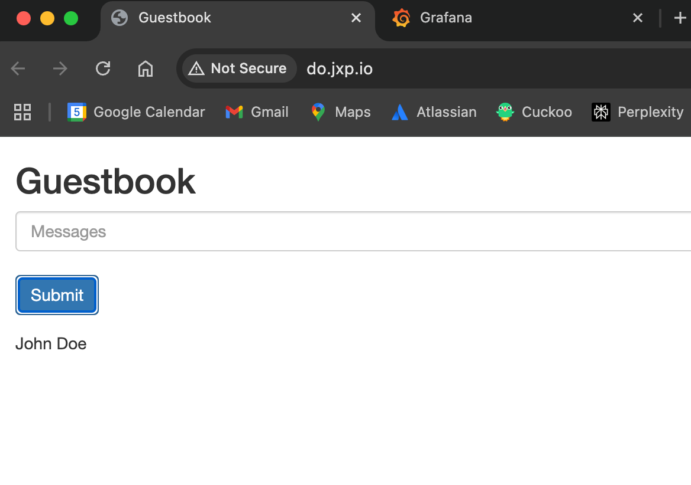
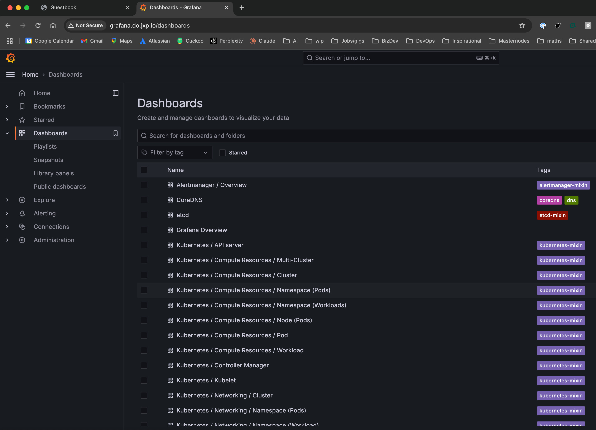
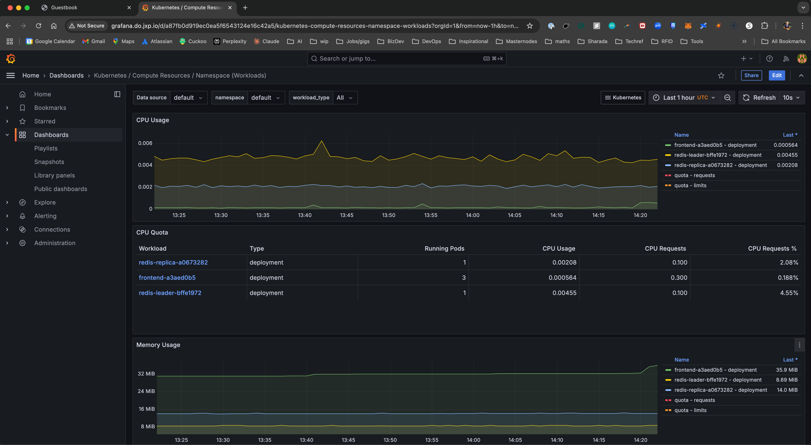
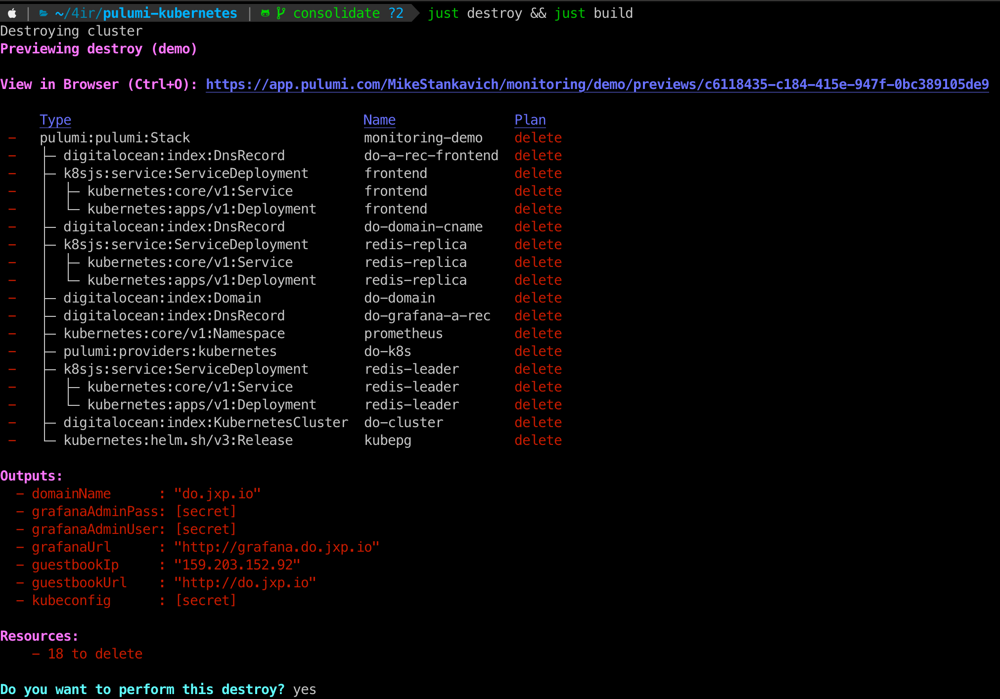
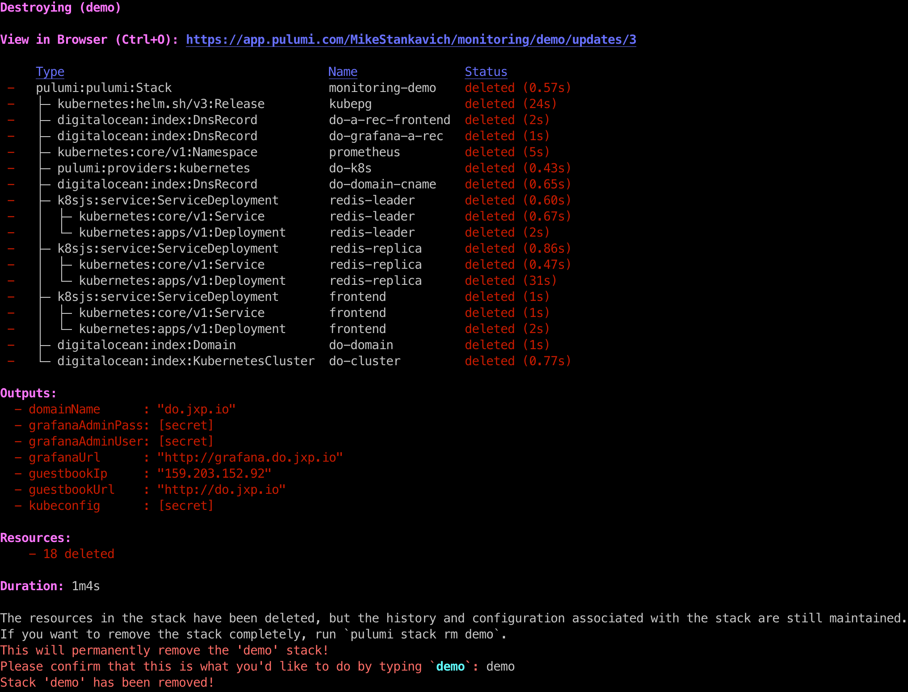

# Kubernetes Guestbook Prometheus and Grafana challenge

### Instructions to deploy the application.
This example uses Pulumi Typescript with Digital Ocean. You will need to install the following prerequisites 
to deploy this application. See the screenshots below for an example of what the deployment process looks like.

### Prerequisites
1. The just cli installed, i.e. brew install just
1. Pulumi CLI installed, i.e. brew install pulumi
1. Node.js installed, i.e. brew install node
1. Digital Ocean CLI installed, i.e. brew install doctl
1. Here's a one line brew install command for easy copy/paste: `brew install just pulumi node doctl`
1. An active Digital Ocean account
1. A Digital Ocean API token. Create one at https://cloud.digitalocean.com/account/api/tokens
1. A domain or subdomain that is delegated to Digital Ocean with NS records pointing to Digital Ocean's nameservers.

### Setup
1. Clone this repository, for example git clone https://github.com/mikestankavich/pulumi-kubernetes.git
1. Change to the directory of the cloned repository, for example `cd pulumi-kubernetes`
1. Create a `.env` file in the project root
1. Add the Digital Ocean API token that you created in prerequisite #5 to the DIGITALOCEAN_TOKEN environment veriable in `.env`
1. Optionally install direnv and allow it to load the `.envrc` file with `direnv allow .envrc`. This will automatically 
load the environment variables in the `.env` file when you change to the project directory. See https://direnv.net/
2. Update the variables in `/justfile` if you want to change the domain name or the pulumi stack name 
1. Run `just build` to deploy the application

### Grafana access URL and admin credentials.
1. Run `just outputs` to get the URL and credentials to access Grafana
1. Navigate to http://grafana.do.jxp.io/ and login with the credentials from the previous step. If you changed the domain name in `/justfile` then update the url accordingly.

### How to verify that Guestbook metrics are being scraped by Prometheus.
1. Navigate to Dashboards, and then open the Kubernetes / Compute Resources / Workload dashboard to see compute
   and network metrics for the guestbook application pods

### Tear down the cloud resources so that you don't run up a Digital Ocean bill.
1. Run `just destroy` to tear down the application, the monitoring, and the kubernetes cluster

### Screenshots

